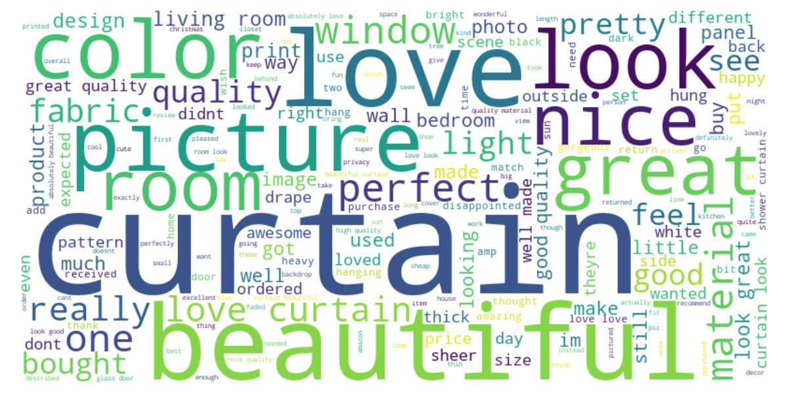

#  Amazon Review Sentiment Analysis

This project analyzes Amazon product reviews to detect sentiment (positive or negative) using natural language processing and machine learning.

---

##  Project Description

The goal is to classify Amazon product reviews as **positive** or **negative** by:

- Cleaning and preprocessing the review text
- Removing stopwords and rare words
- Lemmatizing the words
- Visualizing word frequencies and generating a word cloud
- Using **VADER** for sentiment scoring
- Training classifiers (Logistic Regression and Random Forest) on TF-IDF features

---

##  Libraries Used

- `pandas`
- `numpy`
- `nltk`
- `textblob`
- `scikit-learn`
- `matplotlib`
- `wordcloud`
- `PIL`

---

##  Visualizations

###  Most Frequent Words in Reviews


---

###  Word Cloud



---

##  Model Performance

| Model               | Accuracy (5-Fold CV) |
|--------------------|----------------------|
| Logistic Regression| 0.8904   |
| Random Forest      | 0.9153     |


---

##  Sentiment Labeling

Sentiment scores are generated using **VADER** from NLTK. Reviews with a compound score > 0 are labeled as **positive**, otherwise **negative**.

---

##  Random Prediction Example

At the end of the script, a **random review** is selected and its predicted sentiment is printed using the trained Logistic Regression model.

---

##  How to Run

1. Make sure you have all the required libraries installed:
   ```bash
   pip install pandas numpy nltk textblob scikit-learn matplotlib wordcloud pillow
   ```
2. Run the Python script:
   ```bash
   python sentiment_analysis.py
   ```
##  Outputs

**Console:**

- Logistic Regression CV Accuracy  
- Random Forest CV Accuracy 
  

 ##  License

This project is licensed under the **MIT License**.  
You are free to use, modify, and distribute this software with proper attribution.
